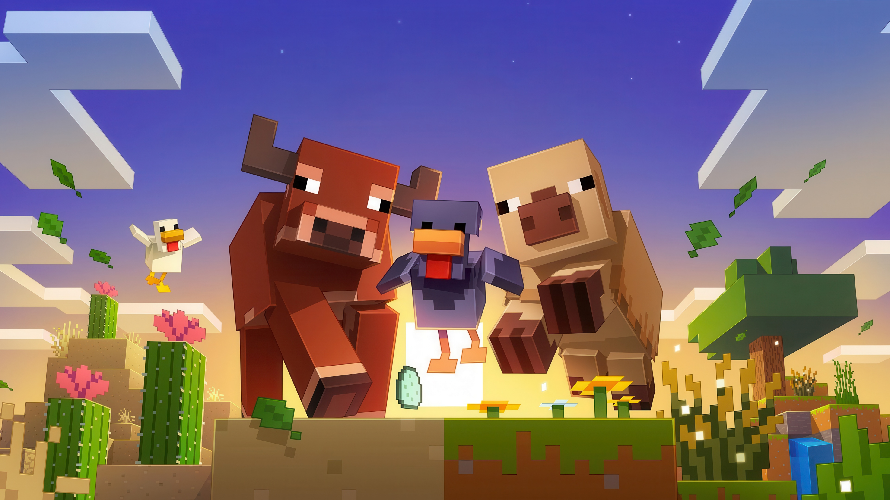

  
    
  <h1>⚔️ Cafaalia SMP - Official Website</h1>
  
Modern, Fast, and Official Minecraft-Themed Single Page Application (SPA).

  
<b>✨ Designed & Developed by Nanda (ZeroLogic) ✨</b>

---

## 🌟 Tentang Proyek
Website ini adalah portal informasi resmi untuk komunitas **Cafaalia SMP**, sebuah server Minecraft Cross-Play (Java & Bedrock) berbasis OneBlock & Survival. 

Baru saja dirombak total (*Major Update*) dengan mengusung gaya desain **Glassmorphism** (transparan & blur) yang memberikan kesan elegan dan modern. Dibangun dengan konsep *Single Page Application* (SPA) sehingga navigasi perpindahan tab terasa sangat instan tanpa *loading* ulang halaman.

## ✨ Fitur Utama
- **⚡ SPA Navigation:** Perpindahan mulus antar menu (Home, Ranks, Store, Crates, Guide, Community) secara instan dalam satu file HTML.
- **🟢 Real-time Server Status:** Menampilkan status server (Online/Offline) dan jumlah *player* aktif secara akurat menggunakan integrasi `mcsrvstat.us` API.
- **💎 Modern Glassmorphism UI:** Desain antarmuka baru dengan efek *transparan* dan *backdrop-blur* yang membuat *background* lebih dinamis dan estetik.
- **💬 Social Integration:** Integrasi tab komunitas (Discord & WhatsApp) serta akses cepat ke grup WhatsApp melalui navigasi header.
- **📋 One-Click Copy:** Kemudahan menyalin IP Server (Java & Bedrock) dengan notifikasi *Toast* animasi ala *achievement* di dalam game.
- **📱 Fully Responsive:** Nyaman dan rapi diakses lewat PC ultra-wide, Tablet, maupun Smartphone.

## 🛠️ Tech Stack yang Digunakan
- **HTML5:** Struktur dasar semantik.
- **Vanilla JavaScript:** Logika routing *Hash-based* SPA, *Clipboard API*, dan *Asynchronous Fetch* untuk status server.
- **Tailwind CSS (via CDN):** Pengaturan utilitas CSS kustom tingkat lanjut untuk menciptakan desain modern, *glassmorphism*, dan responsivitas.
- **FontAwesome:** Pustaka ikon antarmuka.

## 👤 Kredensial & Author
Proyek ini didesain, di-*coding*, dan dikembangkan secara independen oleh:
* **Developer:** [Nanda (ZeroLogic)](https://github.com/ZeroLogic-18)
* **Status Proyek:** Production / Active
* **Domain Utama:** `cafaaliaserver.hopto.org`

---

  <i>© 2026 Cafaalia SMP Team. Not associated with Mojang AB or Microsoft.</i> 
  <i>Built with ☕ and ❤️ by ZeroLogic</i>

